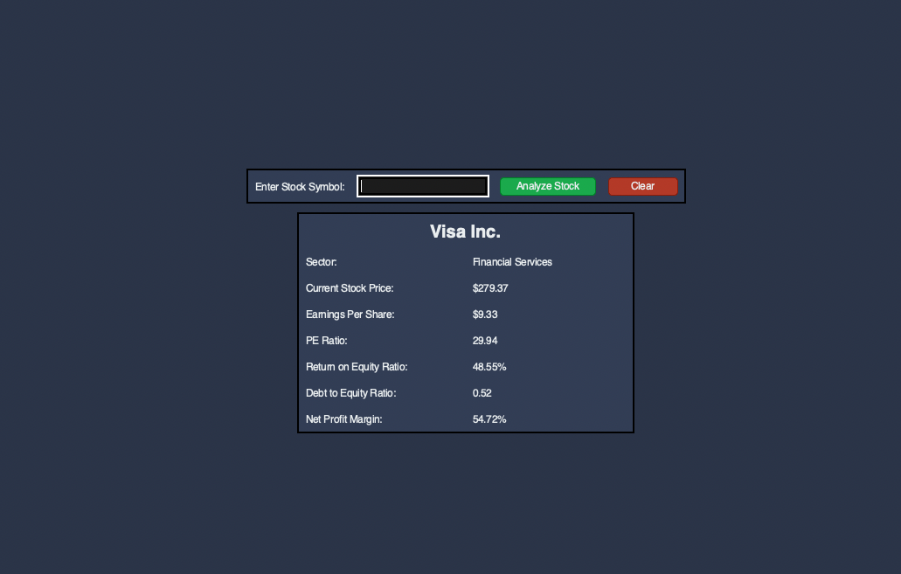
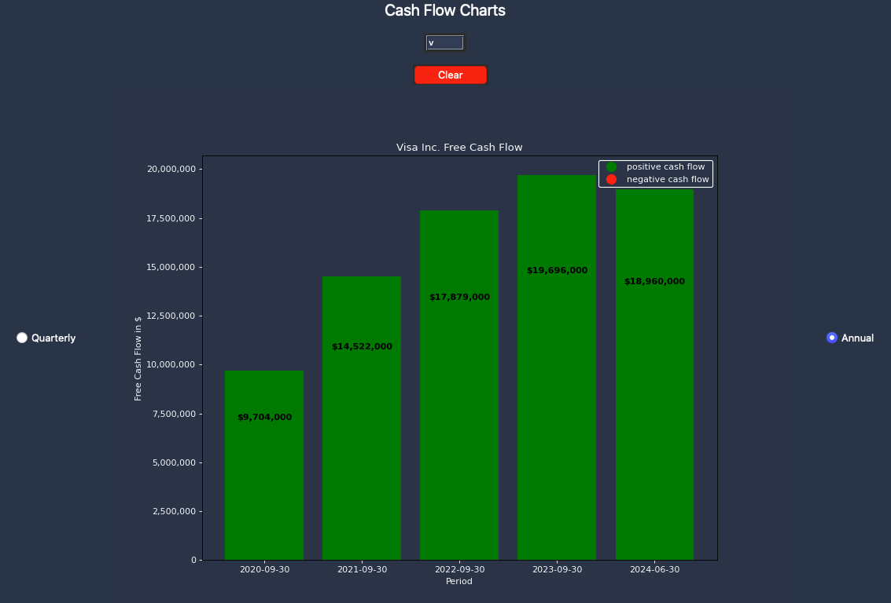

# Stock Analysis App

The **Stock Analysis** application is a Python-based tool that leverages the `yahooquery` package to fetch real-time stock data. The frontend is built using `Tkinter`, allowing users to analyze financial ratios and view visual representations of key financial statement line items through bar and trend charts.

### Purpose
The goal of this application is to provide users with ratio analysis and visualize data from financial statements in a user-friendly manner. The application helps you assess the financial health of a company by displaying:
- Free Cash Flow (from the Cash Flow statement)
- Long Term Debt (from the Balance Sheet)
- Net Income (from the Income Statement)
- Total Revenue

Additionally, it provides a trend analysis comparing Cash from Operations and Net Income, supporting [cash-based earnings quality analysis](https://www.investopedia.com/terms/q/qualityofearnings.asp).

**Note:** This application does not constitute investment advice or recommendations for any particular stock or investment strategy.

---

## Demo

When a user enters a stock symbol, multiple [financial ratios](https://www.investopedia.com/financial-ratios-4689817) are displayed:


The bar graphs show:
- **Free Cash Flow** (from the Cash Flow statement)
- **Long Term Debt** (from the Balance Sheet)
- **Net Income** (from the Income Statement)
- **Total Revenue**

Each graph allows the user to toggle between quarterly and yearly views for better comparison.


The application also features a trend graph comparing **Cash from Operations** and **Net Income**, aiding in the analysis of earnings quality.

---

## Installation and Usage

### Prerequisites
- Python 3.x
- `pipenv` for package management

### Installation Steps
1. Install `pipenv` if you don't already have it:
   ```bash
   pip install pipenv
   ```

2. Install the required dependencies:
   ```bash
   pipenv sync
   ```
   If you're in a development environment, use:
   ```bash
   pipenv sync --dev
   ```

3. Run the application:
   ```bash
   python userInterface.py
   ```

### Optional
If `Tkinter` is not installed on your machine, you can install it by running:
```bash
sudo apt-get install python3-tk
```

---
